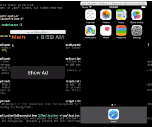

# AppleWatchSimpleAdDemo
This demo illustrates a possible ad on Apple Watch, which can modally activate a view controller that shows the landing page of this ad on iPhone.

演示苹果手表上一种可能的广告实现形式：在手表上展示广告的概况，用户触发后，在iPhone上的相应app里激活完整的广告跳转页面。

## Preview

## Credit

Thanks to the following projects, which give us a beautiful web browser.

* [KINWebBrowser](https://github.com/dfmuir/KINWebBrowser) - A web browser module for your iOS apps.
* [TUSafariActivity](https://github.com/davbeck/TUSafariActivity) -  a UIActivity subclass that provides an "Open In Safari" action to a UIActivityViewController
* [ARChromeActivity](https://github.com/alextrob/ARChromeActivity) - a UIActivity subclass that provides an "Open In Google Chrome" action to a UIActivityViewController

## License

[MIT license](LICENSE). 